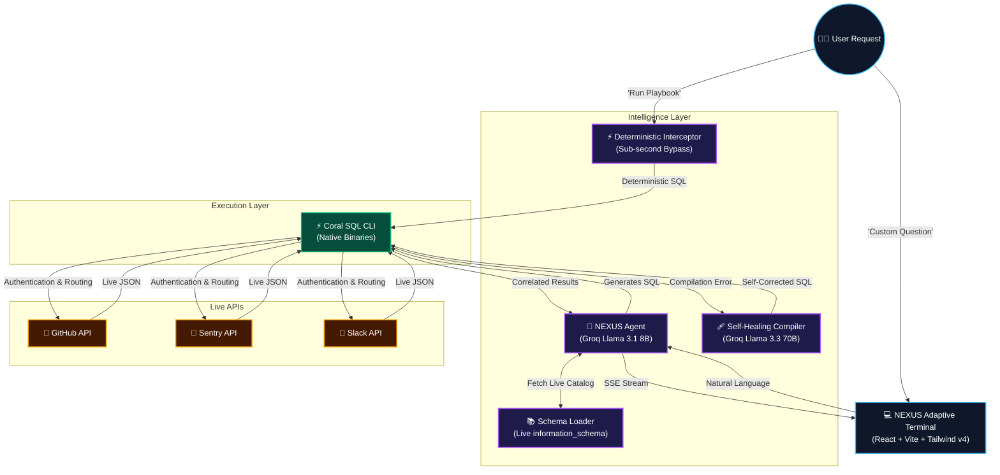

<div align="center">
  
  <h1>NEXUS: Autonomous War Room Engine</h1>
  <p>An AI-driven, real-time incident orchestration platform that unifies your entire engineering stack (GitHub, Sentry, Slack, Datadog) into a single, queryable intelligence layer via the Coral CLI.</p>
</div>

---

## 🚀 The Problem: The Context Switching Crisis
When critical infrastructure goes down, engineers waste precious minutes jumping between PagerDuty, Datadog, Sentry, Slack, and GitHub. Triaging an incident requires correlating fragmented data across siloed platforms, leading to extreme burnout and massive financial losses.

## ⚡ The Solution: Data-Driven Orchestration
**NEXUS** reduces context switching. Instead of humans manually querying 5 different tools, NEXUS uses an **LLM-powered reasoning engine** backed by the **Coral SQL Engine** to unify the stack.

NEXUS takes natural language (e.g., *"Why did the payment API fail?"*), writes cross-platform SQL `JOIN` statements, executes them against the environment, and generates a structured autopsy.

## 🏗️ System Architecture



## ✨ Key Features
*   **Hybrid AI Compilation Pipeline:** Combines the ultra-low latency of **Llama 3.1 8B** for rapid initial SQL drafting with the reasoning depth of **Llama 3.3 70B** to self-heal complex DataFusion query planner syntax errors on the fly.
*   **Deterministic Playbook Interceptor:** Zero-latency bypass path that serves pre-optimized canonical "War Room" SQL directly to the execution layer, guaranteeing 100% accuracy for standard incidents.
*   **Dynamic Live Schema Discovery:** Bypasses traditional static metadata stores by dynamically scanning Coral's active tables via `information_schema` with whitelist column trimming to enforce strict token efficiency.
*   **Adaptive Streaming Dashboard:** React client backed by Server-Sent Events (SSE) streaming from FastAPI, featuring threshold-aware auto-scrolling (no scroll hijacking) and a responsive CSS grid that splits from a single focused panel to a dual terminal layout.
*   **Cross-Source JOINs:** Harnesses Coral's advanced processing engine to run distributed `LEFT JOIN` queries linking GitHub, Sentry, and Slack datasets seamlessly.

## 🛠️ Tech Stack & Architecture Roles
<div align="center">
  
  
  
  
  
  
  
  
</div>

*   **Visualization & UI:** React + Lucide Icons + Tailwind CSS v4
*   **Reasoning & Intelligence:** Groq (Llama 3.1 8B & Llama 3.3 70B Hybrid Cluster)
*   **Data Execution & Joins:** Official Coral SQL CLI (Live API Binding)

## 🚀 Getting Started

### Prerequisites
*   Docker & Docker Compose
*   Groq API Key (for the LLM)
*   Personal Access Tokens for GitHub, Sentry, etc.

### Installation
1. Clone the repository:
   ```bash
   git clone https://github.com/ramakrishnanyadav/Pirates-Of-Coral-Nexus.git
   cd Pirates-Of-Coral-Nexus
   ```
2. Configure your environment variables:
   ```bash
   cp .env.example .env
   ```
   *Add your `GROQ_API_KEY`, `GITHUB_TOKEN`, and `SENTRY_AUTH_TOKEN` to the `.env` file.*

3. Spin up the cluster:
   ```bash
   docker-compose up -d --build
   ```

4. Access the War Room:
   Open [http://localhost:5173](http://localhost:5173) in your browser.

## 🔒 Security
All API keys are securely injected into the Docker container at runtime and are strictly excluded from version control via `.gitignore`. 

---
<div align="center">
  <p>Built with ❤️ by <b>Ramakrishnan</b> for <b>Pirates of Coral</b>.</p>
</div>
