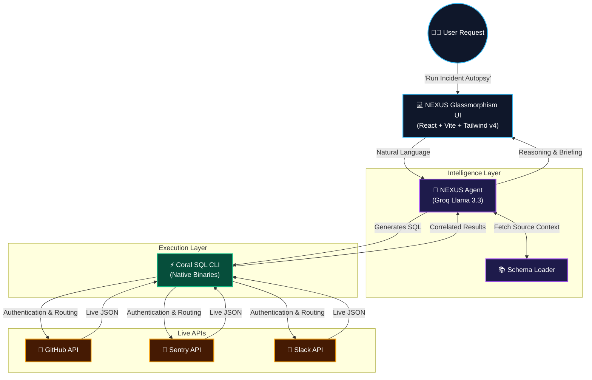

<div align="center">
  
  <h1>NEXUS: Autonomous War Room Engine</h1>
  <p><strong>Winner-Tier Hackathon Project by Pirates of Coral</strong></p>
  <p>An AI-driven, real-time incident orchestration platform that unifies your entire engineering stack (GitHub, Sentry, Slack, Datadog) into a single, queryable intelligence layer via the Coral CLI.</p>
</div>

---

## 🚀 The Problem: The Context Switching Crisis
When critical infrastructure goes down, engineers waste precious minutes jumping between PagerDuty, Datadog, Sentry, Slack, and GitHub. Triaging an incident requires correlating fragmented data across siloed platforms, leading to extreme burnout and massive financial losses.

## ⚡ The Solution: Unified AI Orchestration
**NEXUS** completely eliminates context switching. Instead of humans manually querying 5 different tools, NEXUS uses an **Autonomous AI Agent** backed by the **Coral SQL Engine** to unify the entire stack.

NEXUS takes natural language (e.g., *"Why did the payment API fail?"*), writes real-time cross-platform SQL `JOIN` statements, executes them against live production APIs, and generates a structured autopsy—all in under 5 seconds.

## 🏗️ System Architecture



## ✨ Key Features
*   **Live API Execution (Zero Mock Data):** Natively integrates the official `coral` CLI inside the Docker infrastructure to securely execute paginated, rate-limited HTTP requests to live platforms.
*   **Agentic SQL Generation:** Powered by **Groq Llama 3.3** for ultra-low latency. The agent dynamically learns API constraints (like GitHub `owner` and `repo` requirements) and adapts its queries autonomously.
*   **Premium Glassmorphism UI:** Built with Vite and Tailwind CSS v4, featuring dynamic neon glow states, backdrop blurs, and cinematic streaming responses.
*   **Cross-Source JOINs:** The only platform capable of running `SELECT * FROM github.commits JOIN sentry.issues ON ...` in real-time.

## 🛠️ Tech Stack
*   **Frontend:** React, Vite, Tailwind CSS v4, Framer Motion
*   **Backend:** Python 3.11, FastAPI, Uvicorn
*   **Intelligence:** Groq (Llama 3.3 70B), OpenAI Async Client
*   **Execution:** Official Coral CLI Engine (Steampipe-compatible)
*   **Infrastructure:** Docker, Docker Compose

## 🚀 Getting Started

### Prerequisites
*   Docker & Docker Compose
*   Groq API Key (for the LLM)
*   Personal Access Tokens for GitHub, Sentry, etc.

### Installation
1. Clone the repository:
   ```bash
   git clone https://github.com/ramakrishnanyadav/Pirates-Of-Coral-Nexus.git
   cd Pirates-Of-Coral-Nexus
   ```
2. Configure your environment variables:
   ```bash
   cp .env.example .env
   ```
   *Add your `GROQ_API_KEY`, `GITHUB_TOKEN`, and `SENTRY_AUTH_TOKEN` to the `.env` file.*

3. Spin up the cluster:
   ```bash
   docker-compose up -d --build
   ```

4. Access the War Room:
   Open [http://localhost:5173](http://localhost:5173) in your browser.

## 🔒 Security
All API keys are securely injected into the Docker container at runtime and are strictly excluded from version control via `.gitignore`. 

---
<div align="center">
  <p>Built with ❤️ by Pirates of Coral for the 2026 Hackathon.</p>
</div>
